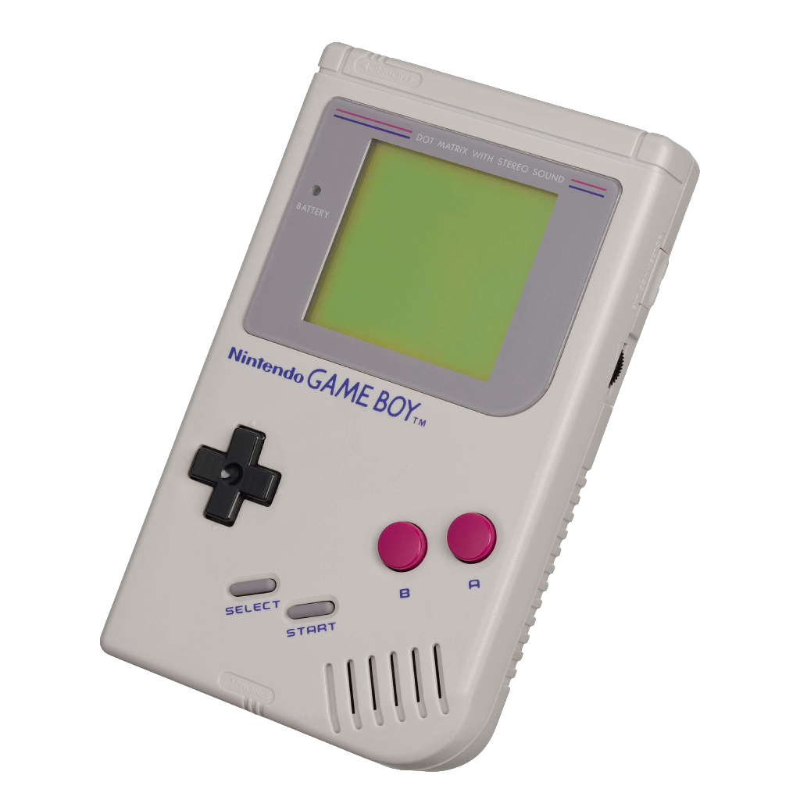
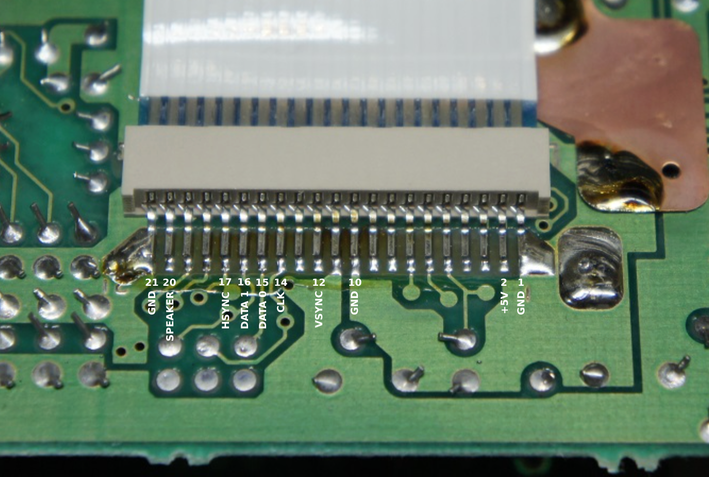
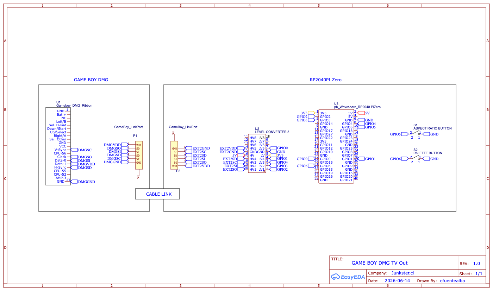
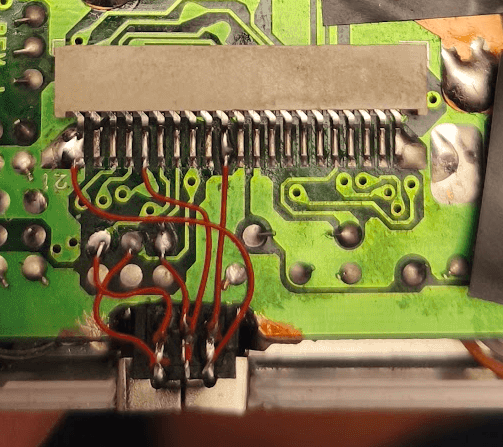
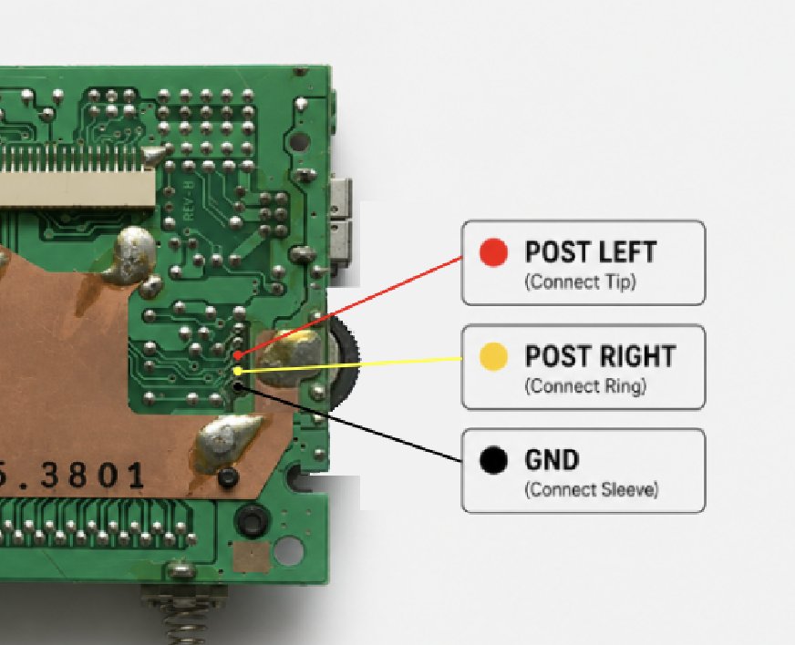
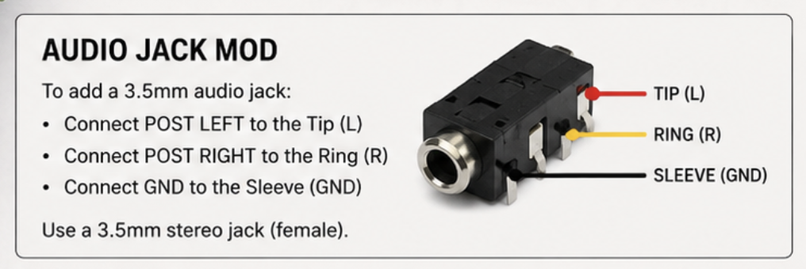
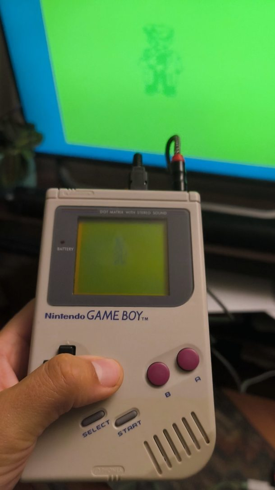

# GAME BOY DMG-001 → HDMI Output

<p align="center">
    <picture>
        
    </picture>
</p>

A hardware project that captures the original LCD video signals from a Nintendo Game Boy DMG-001 and outputs them to any HDMI monitor or TV using an RP2040-based board.

## Overview

<p align="center">
    <picture>
        
    </picture>
</p>

The Game Boy's Sharp LR35902 CPU generates the LCD timing and pixel data signals (VSYNC, HSYNC, Pixel Clock, D0, and D1) using 5 V logic levels. These signals are converted to 3.3 V through dedicated BSS138-based level shifters and then captured by the RP2040 using its programmable I/O (PIO) peripherals.

The RP2040 reconstructs the original 160×144 framebuffer in real time and generates a DVI/TMDS video stream, allowing the Game Boy image to be displayed on modern HDMI-compatible monitors and televisions.

## Features

- Real-time video capture from an original Game Boy DMG-001
- HDMI output through RP2040 DVI/TMDS generation
- No emulation — video is generated directly from the original hardware signals
- Compact installation inside the original Game Boy shell
- Low-cost and widely available components

## Hardware Requirements

- Nintendo Game Boy DMG-001
- RP2040 Pi Zero (or compatible RP2040 board with DVI support)
- BSS138 N-MOSFET level shifters (one per signal)
- 10 kΩ pull-up resistors
- Micro-HDMI connector
- Optional 3.5 mm audio output

## Game Boy DMG-001 LCD Connector Pinout

<p align="center">
    <picture>
        
    </picture>
</p>

| Pin | Signal | Description |
|------|---------|-------------|
| 01 | GND | Ground |
| 02 | Power LED | Unregulated battery voltage |
| 03 | LCD Drive Voltage | -19 V generated by the CPU voltage converter |
| 04 | Left & B | Left and B buttons |
| 05 | Button Diodes 1 & 2 | Button matrix diodes |
| 06 | Down & Start | Down and Start buttons |
| 07 | Up & Select | Up and Select buttons |
| 08 | Right & A | Right and A buttons |
| 09 | Button Diodes 3 & 4 | Button matrix diodes |
| 10 | GND | Ground |
| 11 | VCC | Regulated 5 V supply |
| 12 | VSYNC (?) | Likely vertical synchronization signal |
| 13 | Unknown | Connected to LCDV6 and LCDH7 |
| 14 | Pixel Clock (?) | LCD pixel clock |
| 15 | DATAOUT0 | LCD pixel data bit 0 |
| 16 | DATAOUT1 | LCD pixel data bit 1 |
| 17 | HSYNC | Horizontal synchronization signal |
| 18 | Unknown | Connected to LCDV10 and LCDH12 |
| 19 | Unknown | Connected to LCDH13 |
| 20 | Speaker | Audio output |
| 21 | GND | Ground |

> **Note:** Some LCD-related signals have not been fully documented and are identified based on reverse engineering and oscilloscope analysis.

## Schematics

<p align="center">
    <picture>
        
    </picture>
</p>

## Game Boy Modification

To keep the modification fully enclosed inside the original shell, a small section of the PCB was trimmed to create space for the link cable connector.

For easier assembly, the installation uses the ribbon cable connector pads instead of soldering directly to the LCD traces.

<p align="center">
    <picture>
        
    </picture>
</p>

## Audio Jack Modification

The Game Boy DMG-001 already provides stereo audio signals on the rear side of the main PCB, making it possible to add a standard 3.5 mm stereo audio jack without modifying the original audio circuitry.

### Connection Points

Use the following pads shown in the image above:

| Signal | Description | Audio Jack Connection |
|----------|-------------|----------------------|
| POST LEFT | Left audio channel (after volume control) | Tip (L) |
| POST RIGHT | Right audio channel (after volume control) | Ring (R) |
| GND | Ground | Sleeve (GND) |

<p align="center">
    <picture>
        
    </picture>
</p>

### Wiring Diagram
Game Boy DMG-001               3.5 mm Stereo Jack

POST LEFT   -----------------> Tip (Left)
POST RIGHT  -----------------> Ring (Right)
GND         -----------------> Sleeve (Ground)


<p align="center">
    <picture>
        
    </picture>
</p>


## Final Result

[](https://www.instagram.com/p/DXp1UvBEUVj/ "GB TV Out in Action")

## DIY Parts List

### Required

- [RP2040 Pi Zero](https://s.click.aliexpress.com/e/_c3eepyXz)
- [5 V ↔ 3.3 V Level Shifter](https://s.click.aliexpress.com/e/_c3Bf8Tpz)
- [Mini-HDMI to HDMI Cable](https://s.click.aliexpress.com/e/_c2vEa6W7)
- [Game Boy Link Cable](https://s.click.aliexpress.com/e/_c3ozYTbh)
- [EXT Link Connectors (x2)](https://s.click.aliexpress.com/e/_c4UrJ7iB)
- [3.5 mm Audio Jack](https://s.click.aliexpress.com/e/_c3Rsd2jX)
- [3×7 Prototype PCB](https://s.click.aliexpress.com/e/_c2vo2uS5)
- [Micro USB Cable](https://s.click.aliexpress.com/e/_c3w8XLAZ)
- [2×20 Female GPIO Header](https://s.click.aliexpress.com/e/_c30xKN1n)
- [Push Buttons](https://s.click.aliexpress.com/e/_c2IJ9HbF)

### Optional

- [Game Boy DMG Replacement Shell](https://s.click.aliexpress.com/e/_c4pZA6Kj)
- [Game Boy DMG Glass Lens (Light Gray)](https://s.click.aliexpress.com/e/_c4oHB3KJ)


## Quick Start (Prebuilt Firmware)

If you only want to test the project, you can use a precompiled firmware release without installing the Pico SDK or building the source code yourself.

### 1. Download the Firmware

Download the latest `gameboy_dvi.uf2` firmware file from the Releases page:

https://github.com/EstebanFuentealba/GAME-BOY-DMG-HDMI-TVOut/releases

### 2. Put the RP2040 into Bootloader Mode

1. Disconnect the RP2040 from USB.
2. Press and hold the **BOOT** button on the RP2040 board.
3. While holding the button, connect the USB cable to your computer.
4. Release the **BOOT** button.

The RP2040 will appear as a USB mass storage device named:


### 3. Install the Firmware

Simply drag and drop the `gameboy_dvi.uf2` file onto the `RPI-RP2` drive.

The board will automatically reboot once the file has been copied.

### 4. Connect the Hardware

After flashing:

- Connect the HDMI cable to the RP2040 board.
- Power on the Game Boy.
- The HDMI output should appear automatically on your monitor or TV.

No additional software or drivers are required.

> **Note:** If the `RPI-RP2` drive does not appear, verify that the BOOT button was held while connecting the USB cable.


## Building the Firmware

```bash
export PATH=/opt/homebrew/bin:/usr/local/bin:$PATH

cd build
cmake ..
make -j$(sysctl -n hw.logicalcpu)
```


## References

- https://web.archive.org/web/20190319094359/https://lowgain-audio.com/GBclassicmod.htm

## License

This project is provided for educational and research purposes. Nintendo, Game Boy, and all related trademarks are property of their respective owners.